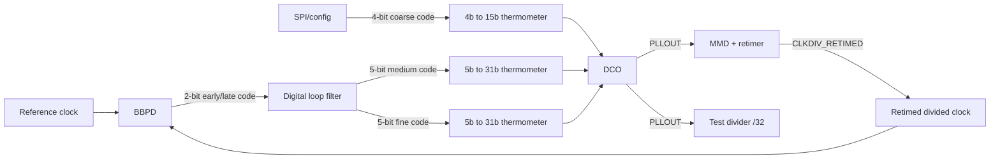

# OpenPLL Architecture Description

This document is the self-contained architecture description shipped with
OpenPLL. The target architecture is an integer-N, mostly synthesizable,
bang-bang digital PLL. The digital feedback loop is implemented in RTL and the
timing critical analog behavior is implemented with standard-cell gate-level
circuits.
The current Sky130 implementation uses an 8-bit DCO tuning code decoded into a
255-line thermometer load bank for SPICE-validated frequency control. The load
cells are physically active when their thermometer controls are high; the RTL
defaults to an inverted DCO decoder so increasing top-level `DCO_CODE` reduces
load and increases DCO frequency.

## Current Sky130 Deliverable

The current promoted implementation track is the `IntegerPLL_HardMacroTop_EINVP`
path: a signed-off Sky130 digital core, filled BBPD macro, filled
`IntegerPLL_DCO_EINVP` macro, and hard-top interconnect. It is still an
integer-N bang-bang digital PLL, with an 8-bit exported `DCO_CODE`, 255 physical
thermometer load controls, and an 8-bit programmable `MMDCLKDIV_RATIO`.

The selected TT operating point is the hard-top-loaded EINVP DCO near code 128.
The standalone filled EINVP RCX DCO measures 50.955942 MHz at code 0,
60.174879 MHz at code 128, and 72.479371 MHz at code 255. After hard-top
interconnect loading, the promoted lock-window target is 58.573518 MHz at the
nominal mid-code point; the current loop diagnostics use `NDIV=2` and
`REF=29.286759 MHz` for that target.

The strongest convergence evidence is not the short mixed-signal smoke. It is
the hard-top-loaded extracted-DCO lock-window evidence: low rail start reaches
codes 122..128 with 58.485654 MHz tail frequency and 0.087865 MHz target error,
while high rail start reaches codes 126..132 with 58.804895 MHz tail frequency
and 0.231377 MHz target error. The Xyce C-interface mixed-signal path uses the
filled extracted BBPD in Xyce with a compiled digital driver and behavioral
DLF/DCO table; it is promoted as polarity and gain evidence, especially showing
that nonzero `KP` improves acquisition versus `KP=0`, but it is not yet the
full post-layout PLL lock signoff path.

## 1. Architecture Summary

The PLL multiplies a reference clock by a programmable integer division ratio.
The loop compares the reference clock against a retimed divided clock, filters
the bang-bang phase information digitally, and tunes a digitally controlled
oscillator (DCO).



Main design points:

- PLL type: integer-N digital PLL with bang-bang phase detection.
- Frequency relation: `Fout = Fref * N`.
- Loop polarity is configurable in the digital loop filter.
- DCO tuning is split into coarse, medium, and fine banks.
- The feedback divider output is retimed near the DCO output before it returns
  to the phase detector and clocks the loop filter.
- The design separates ordinary synthesizable RTL blocks from timing-sensitive
  gate-level blocks.
- The Sky130 DCO load-bank polarity is explicit: high load controls slow the
  oscillator, while the default top-level `DCO_CODE` polarity increases
  frequency as the code increases.

## 2. Block Partitioning

| Block | Implementation class | Purpose |
| --- | --- | --- |
| `IntegerPLL_Top` | RTL integration | Top-level digital interconnect and control routing. |
| `BBPD` | Gate-level standard-cell circuit | Bang-bang phase detector. Produces a 2-bit early/late code. |
| `IntegerPLL_DLF` | Synthesizable RTL | Digital loop filter with proportional and integral paths. |
| `IntegerPLL_4B2TH` | Synthesizable RTL | Converts 4-bit coarse binary code to a 15-bit thermometer code. |
| 5b-to-31b B2TH decoders | Synthesizable RTL | Convert medium/fine binary control fields to thermometer banks. |
| `IntegerPLL_MMD_Retimer` | Synthesizable RTL, placed close to DCO | Programmable divider plus retiming for loop feedback. |
| `IntegerPLL_Divider` | Synthesizable RTL, placed close to DCO | Divide-by-32 observation output for PLL testing. |
| `DCO` | Gate-level standard-cell circuit | Converts thermometer control banks into output frequency. |

## 3. Top-Level Signals

The reference report shows these major top-level signals.

| Signal | Direction | Width | Description |
| --- | --- | ---: | --- |
| `REF` | input | 1 | Reference clock for phase comparison. |
| `PLLOUT` | output | 1 | DCO output and PLL clock output. |
| `PLLOUT_DIV` | output | 1 | Divide-by-32 test output from `PLLOUT`. |
| `BBPD` | internal | 2 | Bang-bang phase detector result. |
| `MMDCLKDIV_RATIO` | input | 8 | Programmable integer feedback division ratio. |
| `COARSEBINARY_CODE` | input | 4 | External coarse DCO control, normally from SPI/config. |
| `COARSETHERMAL_CODE` | internal | 15 | Coarse DCO thermometer control. |
| `Medium_CAPS_CTRL` | internal | 31 | Medium DCO thermometer control from DLF MSBs. |
| `Fine_CAPS_CTRL` | internal | 31 | Fine DCO thermometer control from the next DLF bits. |
| `CLKDIV_RETIMED` | internal | 1 | Retimed divided feedback clock for BBPD comparison and DLF updates. |

The DLF control word is wider than the two 5-bit fields that directly drive the
medium and fine decoders. Preserve the internal guard/fractional bits in the RTL
so proportional/integral gain changes do not immediately collapse to the DCO
control resolution.

## 4. Digital Loop Filter

The DLF is the core digital controller. It receives a held 2-bit BBPD decision
and updates the DCO medium/fine controls through a proportional-integral
structure. The raw BBPD pulses are captured in the digital core before they
reach the DLF so short leading/lagging pulses are not missed by exact-edge
sampling.

### 4.1 DLF Interface

| Pin | Direction | Description |
| --- | --- | --- |
| `CLK` | input | Clocked by the retimed feedback divider output. |
| `RESET_N` | input | Active-low global reset. The Sky130 RTL resets filter state to zero so it maps cleanly to standard flops. |
| `DLF_En` | input | Enables loop filter updates. Low freezes the DLF output. |
| `DLF_Clear` | input | Synchronously clears or reloads DLF registers from external data. Normal operation keeps this low. |
| `DLF_Ext_Override` | input | Overrides closed-loop operation with externally supplied DLF data. |
| `DLF_Update` | input | Qualifies integral-state updates when the DLF is clocked faster than the feedback-update rate. Tied high in the default divider-clocked mode. |
| `DLF_IN_POL` | input | Selects BBPD input polarity. The reference design expects this to be asserted. |
| `DLF_Ext_Data` | input | External control data, normally from SPI/config. |
| `DLF_KI` | input | Integral-path gain. |
| `DLF_KP` | input | Proportional-path gain. |
| `BBPD` | input | Held 2-bit bang-bang phase detector decision. |
| `Medium_CAPS_CTRL` | output | Thermometer control derived from the upper medium control bits. |
| `Fine_CAPS_CTRL` | output | Thermometer control derived from the next fine control bits. |

### 4.2 DLF Behavior

The loop filter follows a digital PI form:

- The raw bang-bang detector pulse output is first captured and held as a
  signed update decision.
- The integral path accumulates the update over time.
- The proportional path applies an immediate correction scaled by `DLF_KP`.
- The integral path contribution is scaled by `DLF_KI`.
- The combined control word is decoded into medium and fine DCO control banks.
- If the exported 8-bit DCO code is already at a low or high rail, a further
  outward BBPD command is converted into an inward correction. This startup
  rail-escape behavior prevents the loop from staying pinned at code 0 or 255
  when the first captured BBPD events have the wrong sign for the saturated
  code.
- A default-off proportional rail guard can also invert decisions that would
  make the proportional term drive the exported DCO code into a visible rail.
  This is controlled by `DLF_PROP_RAIL_GUARD`.

In the current Sky130 RTL, `DLF_KI` is an 8-bit unsigned magnitude applied in
the DLF accumulator fractional-LSB domain. The signed-off default uses
`DLF_FRAC_WIDTH=8`, so `DLF_KI=255` moves the held exported 8-bit DCO code by
about 0.25 LSB per accepted BBPD decision. A `DLF_FRAC_WIDTH=6` candidate keeps
the same 10-bit DLF word and exported 8-bit `DCO_CODE`, but raises the integral
step so `DLF_KI=255` is about one exported DCO-code LSB per accepted decision.
`DLF_KP` is scaled into 10-bit `DLF_CODE` LSBs before it is added as an
immediate proportional correction. Since the exported 8-bit `DCO_CODE` is
`DLF_CODE[9:2]`, `DLF_KP=4` is approximately one immediate 8-bit DCO-code step.
This keeps DCO code resolution at 8 bits while exposing both proportional gain
and integral-rate tuning.

The DLF also has optional acquisition-boost parameters. They do not add new
external pins and default to disabled operation. When
`DLF_ACQ_BOOST_SHIFT > 0`, the filter watches for accepted BBPD decisions that
repeat in the same direction. After `DLF_ACQ_BOOST_AFTER` same-direction
updates, the integral step is shifted left by `DLF_ACQ_BOOST_SHIFT`. Any idle
or direction change clears the streak counter. This preserves the normal PI
behavior near lock while allowing a faster large-signal walk away from rail
starts in diagnostic variants.

Two additional default-off acquisition controls target rail-start behavior.
`DLF_ACQ_RAIL_BOOST` applies the acquisition boost immediately in a rail-escape
region instead of waiting for repeated same-direction BBPD decisions.
`DLF_ACQ_FORCE_RAIL_CODE` forces deterministic inward integral updates while
the exported 8-bit code is within that many codes of either rail. For example,
`DLF_ACQ_FORCE_RAIL_CODE=127` drives low starts upward and high starts downward
until the integrator reaches the mid-code neighborhood, after which normal BBPD
PI behavior resumes. This is intentionally an acquisition aid, not a steady
state frequency detector.

The digital core also has a default-off `DLF_UPDATE_ON_PLLOUT` diagnostic mode.
In the default mode, the DLF clock is `CLKDIV_RETIMED` and `DLF_Update` is tied
high. In the diagnostic mode, the DLF clock is `PLLOUT`; the integrator and
acquisition-boost streak state advance only on a one-`PLLOUT`-cycle-delayed
sampled divider-update pulse. The proportional term still uses the held BBPD
decision combinationally, so the diagnostic targets BBPD-to-integrator latency
without intentionally converting the proportional path into a one-cycle pulse.

Recommended operating modes:

| Mode | `DLF_En` | `DLF_Clear` | `DLF_Ext_Override` | Behavior |
| --- | --- | --- | --- | --- |
| Normal lock | 1 | 0 | 0 | BBPD drives the PI loop. |
| Hold | 0 | 0 | 0 | DCO control remains fixed. |
| Clear/reload | X | 1 | 0 | DCO control is driven by external data while filter state is synchronously loaded from external data. |
| External tuning | X | X | 1 | SPI/config data directly controls DLF output. |

## 5. Bang-Bang Phase Detector

The BBPD is a 1-bit phase detector expanded to a 2-bit output code. It is a
timing-sensitive standard-cell circuit, not ordinary RTL. The report shows a
gate-level implementation using two D flip-flops, a reset path, and a delay
element of approximately 100 ps.

The intended code mapping is:

| `BBPD[1:0]` | Signed code | Frequency correction intent |
| --- | ---: | --- |
| `2'b01` | `2'sb01` | Decrease output frequency. |
| `2'b10` | `2'sb11` | Increase output frequency. |

Because the detector and loop filter polarity interact, keep `DLF_IN_POL`
configurable and verify closed-loop polarity in simulation. A polarity error
causes the loop to push the DCO away from lock.

The Sky130 digital core includes a `PLLOUT`-domain BBPD decision latch. It
captures raw `UP`/`DN` BBPD pulse activity with event toggles, updates the held
decision once per retimed feedback-divider edge, and feeds that held decision
to the DLF. The event-capture state is flushed while `DLF_En=0` or
`DLF_Clear=1`, so stale BBPD state from loop bring-up is not consumed as the
first active decision. This is needed because a PFD-style BBPD pulse that starts
on the same edge used as the DLF clock can otherwise be missed, especially for
feedback-leading corrections near lock. The event toggles use a one-event-deep
consumed handshake so a long BBPD pulse cannot toggle twice before the
`PLLOUT`-domain latch samples it.

## 6. Feedback Divider and Retiming

The feedback branch divides `PLLOUT` by the programmable integer ratio and then
retimes the divided clock to the DCO output edge.

| Pin | Direction | Description |
| --- | --- | --- |
| `DIV_IN` | input | Input clock from the DCO output, `PLLOUT`. |
| `RESET` | input | Resets divider registers to zero. |
| `CLK_DIV_RATIO` | input | External programmable division ratio, normally from SPI/config. |
| `CLKDIV_RETIMED` | output | Retimed divided feedback clock. |

Placement guidance:

- Synthesize or place this block so the retiming flip-flop is physically close
  to the DCO output.
- By default, use `CLKDIV_RETIMED` as the BBPD feedback input and as the DLF
  update clock.
- If `DLF_UPDATE_ON_PLLOUT` is enabled for a diagnostic build, keep
  `CLKDIV_RETIMED` as the BBPD feedback input and use the sampled update pulse
  to qualify DLF state changes in the `PLLOUT` domain.
- Do not sample raw BBPD pulses directly at the feedback edge; capture and hold
  a BBPD decision before the DLF consumes it.
- Treat this clock-domain boundary carefully in gate-level timing checks,
  because routing delay directly changes phase detector behavior.

## 7. DCO Control Architecture

The DCO uses split tuning to cover PVT variation while preserving fine
resolution.

| Tuning bank | Binary input | Thermometer output | Source | Role |
| --- | ---: | ---: | --- | --- |
| Coarse | 4 bits | 15 bits | SPI/config | Wide delay/frequency range. |
| Medium | 5 bits | 31 bits | DLF upper field | Main closed-loop correction. |
| Fine | 5 bits | 31 bits | DLF next field | Fine closed-loop correction. |

For the current 8-bit Sky130 DCO macro path, the DLF control word also drives
`DCO_CODE = DLF_CODE[9:2]`. With the default `DCO_THERM_INVERT=1`, code 0
enables all 255 dummy loads and code 255 enables none, so the intended top-level
polarity is that increasing code reduces load and increases oscillator
frequency. The filled Sky130 RCX characterization is positive-gain through the
code-240 tail peak, but the current layout rolls off by 0.654 MHz from code 240
to code 255 at TT. Treat the high-code tail as non-monotonic until the DCO layout
or load-bank sizing is retuned; the promoted loop settings target the midrange
instead of relying on the all-off endpoint. A separate `IntegerPLL_DCO_EINVP`
candidate using tri-state inverter loads has now been hardened and passes sparse
TT filled-RCX monotonic checks from code 0 to 255 and across the high-code tail,
plus FF/FS/SF/SS endpoint smoke, and a parallel
`IntegerPLL_HardMacroTop_EINVP` hard-macro top now instantiates that DCO with
clean signoff, extracted-SPICE interface checks, and MPI16 distributed-RC
extracted-DCO startup plus early low/high first-motion checks.
With a hard-top-loaded reference target, the E hard-top path now also has a
distributed-RC mid-code extracted-DCO lock-window check across nominal/min/max
E hard-top SPEF, plus low/high rail-escape progress and low/high extracted-DCO
rail-start lock-window evidence, plus FF/SS mid-code hold calibration and
near-lock lock-window diagnostics for hard-top-loaded PVT targets, plus FF/SS
low/high rail extracted-DCO PVT rail-start lock-window rows.
With the measured five-point EINVP RCX calibration, it has calibrated
behavioral-DCO low/high lock-window evidence as well. The
original `IntegerPLL_HardMacroTop` remains the NAND-load production path for
the existing rail-start extracted-DCO lock-window transient evidence until the
EINVP top receives broader all-code PVT DCO tuning coverage.

`IntegerPLL_DigitalCore` registers both `DCO_CODE` and `DCO_THERM` by default
with `DCO_CONTROL_REGISTERED=1`. The raw DLF adder output and
binary-to-thermometer decoder can settle through intermediate mapped-gate
states, so the Sky130 validation configuration samples the DCO controls on the
DLF clock before they reach the analog DCO boundary. The parameter can be
disabled for diagnostics, but the promoted Sky130 implementation keeps the
registered control boundary enabled.

The tutorial describes a standard-cell ring DCO style:

- Coarse tuning can use a mirror-delay style path selection network.
- Medium tuning can use NAND-based varactor cells with larger unit delay.
- Fine tuning can use smaller NAND-based varactor loading for sub-stage delay
  resolution.
- Thermometer coding improves monotonicity and avoids large discontinuities from
  binary switching.
- The coarse, medium, and fine ranges should overlap so calibration and locking
  do not depend on exact PVT corner alignment.

Example reference sizing in 65 nm:

| Bank | Bits | Approx. range | Approx. resolution | Notes |
| --- | ---: | ---: | ---: | --- |
| Coarse | 4 | 864 ps | 57.6 ps | Mirror-delay style wide range. |
| Medium | 5 | 99 ps | 3.2 ps | NAND-varactor delay line. |
| Fine | 5 | 13.6 ps | 0.44 ps | Small NAND-varactor delay line. |

These values are design examples from the tutorial, not OpenPLL hard
requirements. The actual numbers depend on the cell library, supply, loading,
layout parasitics, and target output range.

## 8. Binary-to-Thermometer Decoders

The DCO banks are thermometer driven. The 4-bit coarse decoder maps an external
binary code to 15 coarse control lines. The medium and fine decoders map 5-bit
DLF fields to 31 control lines each.

Decoder requirements:

- Monotonic output sequence for increasing binary input.
- No glitches at the DCO control boundary if the decoder output is sampled or
  changed while the oscillator is active.
- Parameterized implementation is preferred so 4b-to-15b and 5b-to-31b variants
  share the same logic pattern.
- Output polarity must match the selected DCO cell convention. Some NAND
  varactor examples use active-low or inverted loading behavior.

## 9. Test Divider

`IntegerPLL_Divider` divides the DCO output by 32 and exposes `PLLOUT_DIV` for
bring-up and measurement.

| Pin | Direction | Description |
| --- | --- | --- |
| `CLK` | input | Directly driven by `PLLOUT`. |
| `RESET` | input | Asynchronous reset for divider registers. |
| `PLLOUT_DIV` | output | Observation clock used to verify PLL operation. |

As with the feedback retimer, place this divider close to the DCO output when
possible to reduce unnecessary high-speed routing delay.

## 10. Lock Sequence

A practical integer-BBPLL bring-up sequence is:

1. Program `MMDCLKDIV_RATIO` to the desired integer multiplication ratio.
2. Program the coarse DCO code so the free-running DCO frequency is near
   `Fref * N`.
3. Load a reasonable DLF external control word through `DLF_Ext_Data`.
4. Hold the loop in reset or clear while clocks stabilize. In the Sky130 top,
   the BBPD reset is held while `DLF_En=0` or `DLF_Clear=1`.
5. Release reset, keep `DLF_IN_POL` at the verified polarity, release
   `DLF_Clear`, and enable `DLF_En`.
6. Observe `PLLOUT_DIV` and the BBPD output distribution.
7. Adjust `DLF_KP` and `DLF_KI` to trade lock speed, jitter, and stability.
8. If the medium/fine controls rail, update the coarse code and restart or
   reload the DLF state.

## 11. Verification Checklist

Minimum checks before layout:

- Divider ratio produces `Fdiv ~= Fref` when `PLLOUT ~= Fref * N`.
- BBPD polarity makes the DLF increase DCO frequency when feedback lags and
  decrease it when feedback leads.
- DLF hold, clear, reset, and external override modes behave deterministically.
- Medium and fine decoder outputs are monotonic over all binary inputs.
- DCO frequency is monotonic across each tuning bank.
- Coarse/medium/fine ranges overlap across PVT corners.
- `PLLOUT_DIV` toggles at `PLLOUT / 32`.
- Retimed feedback clock has no avoidable routing skew from DCO output.

Post-layout checks:

- Gate-level simulation of BBPD reset and delay behavior.
- DCO frequency range, gain, monotonicity, and bank overlap with extracted
  parasitics.
- Closed-loop lock simulation over process, voltage, temperature, and mismatch
  corners.
- Phase-noise or jitter estimation using the extracted DCO and selected loop
  bandwidth.
- Spur and duty-cycle inspection for the feedback divider and retimed clock.

## 12. Jitter and Phase-Noise Considerations

The tutorial highlights the usual digital PLL tradeoffs:

- The PLL suppresses low-offset DCO phase noise inside the loop bandwidth.
- Ring-DCO phase noise and DCO gain strongly affect output jitter.
- Increasing cell strength can reduce jitter but increases power.
- Wider tuning range usually worsens resolution unless tuning is split into
  multiple banks.
- Layout imbalance changes effective loading and can introduce DCO nonlinearity.

For OpenPLL, the most important architectural protections are:

- Use coarse/medium/fine banks instead of one large DCO control bank.
- Keep thermometer banks monotonic and well matched.
- Place high-speed DCO, feedback retimer, and test divider logic close together.
- Keep loop gains configurable through SPI/config.
- Preserve enough DLF internal precision to tune loop dynamics without losing
  fine DCO resolution.

## 13. Architecture Variants

TDC-based and injection-locked PLLs are useful future variants, but they are not
the base OpenPLL architecture.

| Variant | Difference from base BBPLL | When to consider |
| --- | --- | --- |
| TDC-based ADPLL | Replaces BBPD with a multi-bit time-to-digital converter. | Better phase information, more complex TDC design, useful for finer loop control. |
| Injection-locked PLL | Uses reference injection for phase alignment and a frequency tracking loop. | Better synthesizability and potentially lower in-band noise, but requires injection window and frequency-tracking design. |
| Fractional-N PLL | Supports non-integer multiplication ratios. | Requires fractional control support such as TDC/DTC/DSM and spur management. |

## 14. Implementation Notes for OpenPLL

Recommended source organization:

```text
OpenPLL/
  PLL_ARCHITECTURE.md
  rtl/
    IntegerPLL_Top.v
    IntegerPLL_DLF.v
    IntegerPLL_MMD_Retimer.v
    IntegerPLL_B2TH.v
    IntegerPLL_Divider.v
  gate/
    BBPD.v
    DCO.v
```

Until actual RTL is added, this document should be treated as the design
contract for module boundaries and expected behavior. Exact signal widths for
SPI/config buses, DLF gain fields, and DCO cell polarity should be finalized
with the target standard-cell library and top-level integration constraints.
